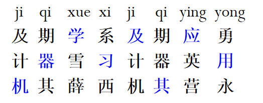
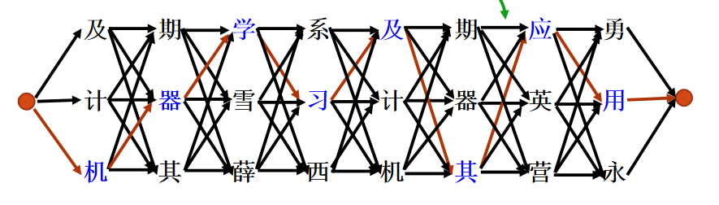
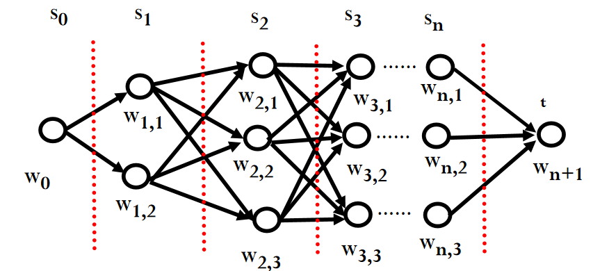

# 人智导作业一:拼音输入法
计35 运沛然 2022010583
## 实验环境
Python版本： 3.10.10 

Package：pypinyin、json、sys、math、os、numpy、time
## 程序简介
---
本程序用来实现拼音到汉字的转换，拼音要求以txt文本形式输入，并且拼音之间带有空格，
程序输出文本文件output.txt,程序运行过程中会产生一些中间文件。

## 语料库使用&预处理
除了必做的新浪新闻语料库，我还使用了选做中`微博情绪分类技术评测（SMP2020-EWECT）中通⽤训练集`这一语料库，预处理方面，我采取了较为简单的方式：循环读取每一个字符，判断其是否为汉字，再加入字典中。

## 算法原理与实现
### 原理：隐马尔可夫模型(HMM)
隐马尔科夫模型指的是一个含有未知参数的马尔可夫过程。而马尔可夫过程指的是未来的状态只取决于当前的状态，而不依赖过去状态的历史信息。
回到这个程序，所谓拼音输入法，实际上就是对拼音串的每一个拼音分别进行对应的预测进而输出汉字，根据模型的不同(2元模型或3元模型),决定每一个拼音输出的影响因子也不同(前一个拼音/前两个拼音)。

设一个拼音串的组成$S=s_1s_2……s_n$,输出的句子组成为$W=w_1w_2……w_n$,我们需要在所有可能的W中，找到概率最大的W。
根据概率论的基本知识：$P(W)=P(w_1w_2……w_n)=\prod_{i=1}^{n}P(w_i|w_1...w_{i-1})$

这样的计算方法过于复杂，我们对其简化，只考虑二元语法下的情况，于是有$P(W)=\prod_{i=1}^{n}P(w_i|w_{i-1})$

因此，最大化P(w)也相当于最大化$logP(w)=\sum_{i=1}^nlogP(w_i|w_{i-1})$,基于条件概率的基本定义,我们可以得出$P(w_i|w_{i-1})=\frac{P(w_iw_{i-1})}{P(w_{i-1})}=\frac{Counts(w_iw_{i-1})}{Counts(w_{i-1})}$

在大量语料库的训练之下，我们得到了不同的两个汉字组合的出现次数和单字的出现次数，但是目前我们还不能解决这个问题，接下来我们还需要使用viterbi算法。

### Viterbi Algorithm: 
该问题可进一步转换成一个求最长路径的问题:

图中$s_i$表示每一个拼音对应的所有汉字组成的层，$w_{ij}$表示第i个拼音对应的第j个汉字，每一个节点都与下一层的所有节点相连接，两个节点之间的边表示距离。同时，每一个节点都储存着从最开始节点到自身的最大距离所对应的路径。

以二元模型为例，对每一个节点（起始节点除外），我们遍历上一层所有节点，找到所有边中距离最大的那条，将其对应的路径与距离储存起来。最后遍历最后一层的所有节点，找到距离最大的节点的信息，我们便可以得到最有可能出现的句子$P(w_1w_2……w_n)$。

此外，为了避免某两个相邻的汉字在语料库中从未出现过的情况，我们对$P(w_i|w_{i-1})$的计算进行了平滑处理：$$P(w_i|w_{i-1})=\lambda \frac{ Counts(w_iw_{i-1})}{Counts(w_{i-1})}+(1-\lambda)\frac{Counts(w_i)}{total\_ counts}$$

而对于第一层节点，我们直接定义其初始距离为该汉字所出现的频率的对数值：$$dis=logP(w_1)=log\frac{Counts(w_1)}{total \_ counts}$$
这样我们就实现了二元模型下的拼音输入法。

### 改进——三元输入法
原理还是和二元相似，只不过在计算拼音串中第三个及其以后的字符时，我们考虑$P(w_i|w_{i-1}w_{i-2})$而不是$P(w_i|w_{i-1})$，因此，我们就需要统计所有三元词组出现的次数。

同二元的情况一样，我们仍需要对其进行平滑处理：$$P(w_i|w_{i-1}w_{i-2})=\lambda_2 \frac{Counts(w_iw_{i-1}w_{i-2})}{Counts(w_iw_{i-1})}+(1-\lambda_2)P(w_i|w_{i-1})=\lambda_2 \frac{Counts(w_iw_{i-1}w_{i-2})}{Counts(w_iw_{i-1})}+(1-\lambda_2)(\lambda \frac{ Counts(w_iw_{i-1})}{Counts(w_{i-1})}+(1-\lambda)\frac{Counts(w_i)}{total\_ counts})$$

此外，我还设置了惩罚值，若二元词组$w_{i-1}w_{i-2}$未曾出现过，则直接返回-100作为两点间距离。
## 测试案例&参数评估
以std_input.txt作为测试案例,共500句。
### 二元：

参数选择与模型效果:
| $\lambda$| 0.99 | 0.9 | 0.85 | 0.8 | 0.75| 0.7 |
|---------|---------|---------|---------|---------|---------|---------|
| 句准确率  |   41.71%  | 41.51%  | 40.3% | 40.12% | 38.32% | 36.93%  |
| 字准确率  |   85.38%  | 85.58%  | 85.36% |85.13%  | 84.66% | 84.16%  |
| 总时间  |   2.94s  | 3.04s  | 3.02s | 3.00s | 3.06s | 2.93s  |

注：这里的总时间不包括读取文件所用的时间。不同$\lambda$取值下平均每句话生成时间差距很小，可近似=0.006s

我们观察到，$\lambda$越接近1，二元模型的效果越好，随着$\lambda$的下降，模型准确率也急速下降。而不同模型的运行所需总时间也没什么区别，所以我们取$\lambda=2$

**复杂性分析**：
设L为拼音序列的长度，N为每个拼音所对应的汉字数量（估算复杂度时近似认为所有拼音都对应N个汉字），那么二元模型的时间复杂度为$\mathbf{O(T*N^2)}$, 因为我们要存储所有拼音所对应的所有汉字的信息，所以空间复杂度是$\mathbf{O(T*N)}$。

真实情况下，我们以测试文档的第一句话为例：
`bei jing shi shou ge ju ban guo xia ao hui yu dong ao hui de cheng shi`
拼音长度L=18，N取平均值=18,每两个节点间大概需要7次计算，那么一共需要进行大概18\*18\*18\*7=40824次计算,而我的电脑每秒钟可以进行大约8000000次计算，那么计算这句话所需的时间大概为t=40824/8000000=0.005秒，小于平均时间0.006s，这可能是因为这句话中的拼音所对应的汉字数量多，以及我在计算总时间时加入了读取input.txt和输出output.txt的时间所导致的。
**案例分析**
1. 正确案例：
```
ji qi xue xi shi dang xia fei chang huo re de ji shu
机器学习是当下非常火热的技术
qing hua da xue de ren gong zhi neng dao lun ke cheng shi fen you qu
清华大学的人工智能导论课程十分有趣
te lang pu jin tian mian dui ji zhe che di feng le
特朗普今天面对记者彻底疯了
zhong guo gong chan dang yuan de chu xin he shi ming shi wei zhong guo ren min mou xing fu wei zhong hua min zu mou fu xing
中国共产党员的初心和使命是为中国人民谋幸福为中华民族谋复兴
nan zi gao zhong sheng de ri chang
男子高中生的日常
ni ru he kan dai e wu zhan zheng
你如何看待俄乌战争
```
2. 错误案例：

```
qing cang da shuai mai
青藏大甩卖
wo yi ba ba ba ba zhu le
我一爸爸爸爸住了
wo cong wei jian guo you ru ci hou yan wu chi zhi ren
我从未见过犹如此后延误迟至人
wo dang chang ba zhe ge dian nao ping mu chi diao
我当场把这个电脑屏幕尺调
ta de dai zi bei sai de gu gu nang nang
他的袋子杯赛的骨骨囊囊
yang guang kai lang da nan hai
阳光开朗大南海
```

可见二元输入法在处理长句子、较为复杂的句子以及带有多音字的句子时准确率较低。
### 三元：
参数选择与模型效果(固定$\lambda_2=0.99$)：
| $\lambda$|  0.99 | 0.95 | 0.9 | 0.8 |
|---------|---------|---------|---------|---------|
| 句准确率  |  58.88%  | 58.68%  | 56.89% | 54.89% |
| 字准确率  |  89.72%  | 89.93%  | 89.14% | 88.65% |
| 总时间  |  4.88s  | 4.91s  | 4.63s | 4.68s |

平均每句话生成时间差距很小，可近似为0.01s。

显然，三元模型比二元模型效果提升很大，同时可以看出，二者有近似的性质，我们取$\lambda_3=0.99$

**复杂性分析：**
理想情况下，三元模型与二元模型的空间复杂度均为$\mathbf{O(T*N)}$,而其时间复杂度为$\mathbf{O(T*N^3)}$，对于每个第三层及以后的节点，我们应完全遍历其前两层的所有节点来计算距离最大值，但这样太耗费时间了，于是我对其进行了简化，改为只求其prev节点和prev.prev节点之间的距离，这样就将三元模型的时间复杂度降到了$\mathbf{O(T*N^2)}$，但同时这也牺牲了模型的准确率，具体时间计算和二元模型类似，就不在这里展示了。

**案例分析**
1. 正确案例：
```
mei ge si nian yi ci de dong ao hui zai jin nian zhao kai le
每隔四年一次的冬奥会在今年召开了
qing cang da shuai mai
清仓大甩卖
ben ci pu cha huo dong you zhu yu bang zhu tong xue men zou chu xin li wu qu
本次普查活动有助于帮助同学们走出心理误区
liang zi jiu chan zuo wei liang zi tong xun de zhong yao zi yuan
量子纠缠作为量子通讯的重要资源
tu shu chu ban ye xu yao cong qi ta fang mian huo de li run de zeng zhang
图书出版业需要从其他方面获得利润的增长
ta de dai zi bei sai de gu gu nang nang
他的袋子被塞得鼓鼓囊囊
```
上述全部句子均在二元模型中翻译错误，其他这样的案例还有很多，可见三元模型确实较大的提升了翻译准确率，而且，我们会发现比起二元模型，三元模型对"出版业"、"鼓鼓囊囊"这样的多字词组的分辨力显著提高。

2. 错误案例：
```
wo he ni wen bie
我和你问别
chen shan de jia ge shi jiu bang shi wu bian shi
衬衫的价格时就帮失误便是
mou ke xue de chao dian ci pao
某科学的潮电磁炮
chun feng hua yu le wei yang
春风化雨了喂养
cong ge zhong bu tong de shi jiao xue dao le hen duo xin de dong xi
从各种不同的是教学到了很多新的东西
zai geng chang yuan de jing ji tu jing zhong
在更常远的经济途径中
```
我们发现，三元模型对一些短句以及二字词组的处理能力有所下降，同时，和二元模型一样，三元模型也不能很好的处理数字、流行性词语的翻译问题，这些可能跟语料库的选取有关。


## 操作方法
使用前提：本程序依赖于python库`pypinyin`,请在使用前安装该库

```pip install pypinyin```

文件夹功能介绍:
"src/:"源代码+语料库+拼音汉字表,包含：
"parameters.py":存放参数。
"read.py":读取拼音文字表(.txt文件)
"pre_training.py":读取语料库数据。
"translation.py":主文件，实现拼音输入法
语料库文件请放入src文件夹内，具体路径:
"src/语料库/......"
语料库文件夹包含sina_news_gbk文件夹和SMP2020文件夹
拼音文字表请放入src文件夹内，具体路径:
"src/拼音文字表.txt"
 
"data/:"测试数据+输出数据+中间文件,包含:
"std_input.txt":测试输入文件
"std_output.txt":标准输出答案
"output.txt":程序输出
以及各种中间生成的json文件

运行方法: 请先进入src目录中，然后在命令行输入`python translation.py ../src/std_input.txt ../src/output.txt`(若使用默认测试文件可以直接输入`python translation.py`)。

特别注意，使用前请务必检查文件是否放置完毕，`parameters.py` 的参数设置是否正确（默认设置是2元输入法+跳过语料库训练，第一次使用请将skip_training改为False）。

此外，本程序输出的句正确率和字正确率所用的标准答案文件为std_output.txt,要改变测试文件，请提前再parameters里更改标准答案文件路径。

## 总结
1.可能的改进措施：
- 二元、三元混合
在测试案例分析的时候，我发现对于大部分句子来说，三元模型都比二元模型的效果要好，可是仍存在一部分句子是二元模型翻译正确但三元模型翻译错误的，究其原因，是因为汉语的词组与短语大多是由两个字组成的，而三元模型并不能很好的翻译二字短语。因此，我们可以考虑在计算的时候将二元模型与三元模型进行混合，并对两个模型赋予不同的权重(其中三元模型的权重较大)，或者进一步使用四元模型，这样也许可以进一步提升模型效果。
- 减少储存空间
随着词组中字的个数的增加，储存所需要的空间也出现了指数级别的增长，储存单字的json文件仅需要93KB，二字的需要50000KB，三字的需要840000KB，而这其中储存的大量信息我们其实并没有用到，因此我们可以对储存文件进行优化，将出现次数少于某一特定阈值的词组信息删去，这样可以极大的减少储存空间，同时也不会对准确率产生过大的影响，是一种时间与空间的trade_off。

2.思考：
- 平滑措施对二元、三元的改进
其实我在一开始是生成了词组对应频率的中间文件用来计算，后来想想，这样不仅浪费的大量的储存空间，也使我难以进行平滑优化，不过我也获得了优化之前的数据，相比之下，二元模型优化后增长微乎其微，而3元模型优化后，字准确率提升0.03，句准确率提升0.01，哪怕是错误的句子也更加正常。为何优化效果有所不同呢，原因是相比二元词组来说，某三个汉字组成的三元词Counts=0的概率大大增加，$即P(w_i|w_{i-1}w_{i-2})=0$的可能性大大增加，所以对三元模型来说，平滑优化更重要。
- 语料库的选取
案例分析中有很多“奇怪”的例子，如qing wa(青蛙)翻译成“青瓦”，nan hai(男孩)翻译成“南海”等完全与实际语句不相关的词语，以及疫情相关的语句几乎都不能正确的翻译。这与语料库的选取有很大关系，本程序使用的语料库以2016年的新浪新闻为主，其中政治相关的词组出现频率很高，而疫情相关的词组很少（毕竟当时还没有新冠）,由此可见，语料库的选取与翻译准确率息息相关。
- 评价指标相关
我认为句正确率这一指标并不能很好的评判模型性能，因为我在分析案例的时候发现，有好多输出的句子和标准答案只差一两个字，同时这一两个字也完全不影响阅读，但句正确率完全无法分辨这种情况。字正确率也有自己的缺陷，有些输出的句子的字正确率并不低，可我却很难理解它表达的什么意思。这两种指标都有自己的优势和不足，我们可以分别赋予这两种指标合适的权重来创造新的评价指标。

3. 感悟

这次的拼音输入法是我第一个用python编写的较为完整的项目，这几个礼拜中我也付出了不少的心血，克服了诸多问题，也锻炼了我对os、json、sys等包的使用能力。在此之前，我一直以为搜狗、百度等输入法需要很复杂的算法，但编完整个程序后我才发现算法的底层逻辑很简单，只是需要大量的数据罢了，这也算是此次作业中一个重要的收获。不过，这些大型输入法除了数据以外还有一个很重要的优势：具有自适应性，能根据用户的输入习惯进行调整。这个特性我认为是非常重要的，要想实现它，我认为还需要采取类似强化学习的方法，即对不同词组施加惩罚或奖励来契合用户的输入习惯，对这个特性的完善就留到将来吧…………

github地址：https://github.com/speacil111/Pinyin_trans

所有的中间文件已上传清华云盘:https://cloud.tsinghua.edu.cn/library/706eeefe-de48-40b4-b770-52a69de5aee6/%E4%BA%BA%E6%99%BA%E5%AF%BC/processed_data